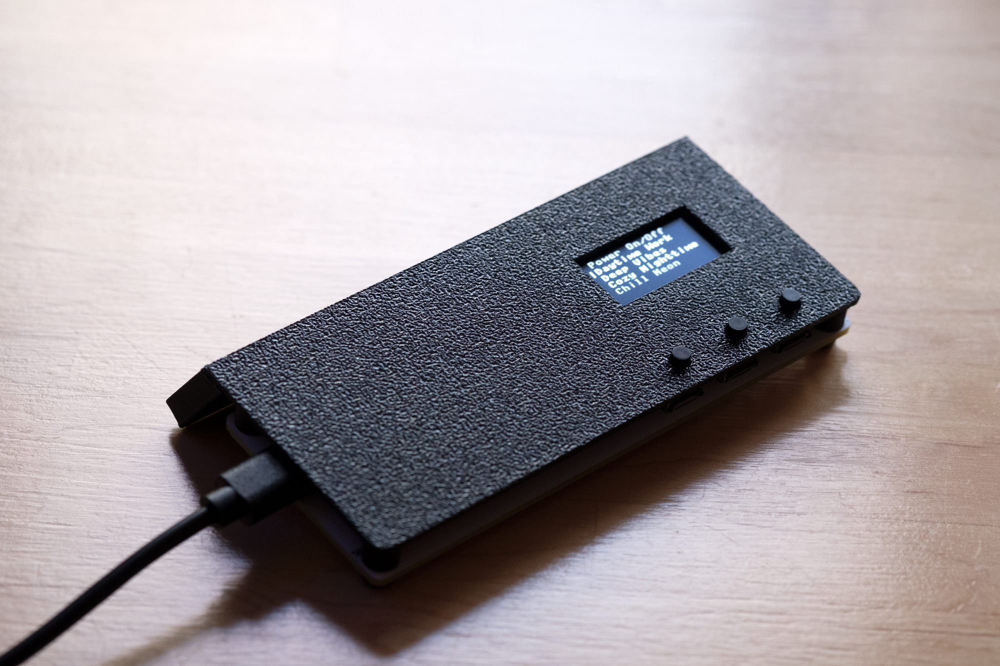
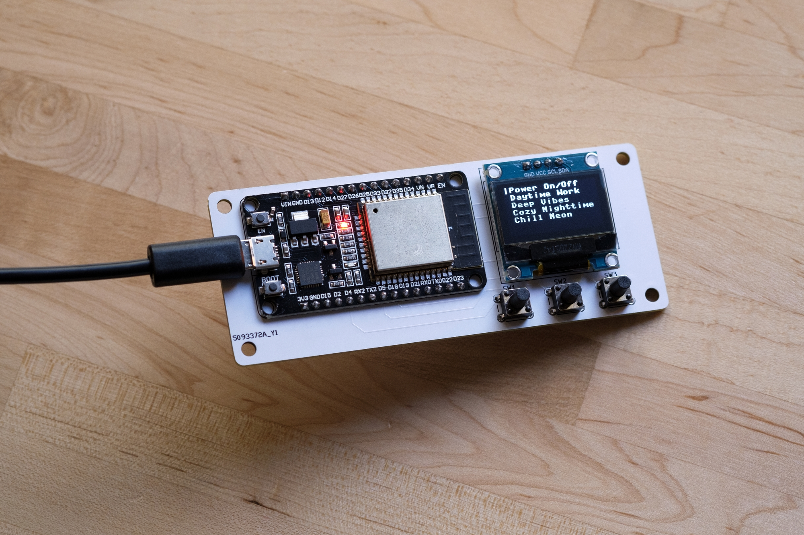
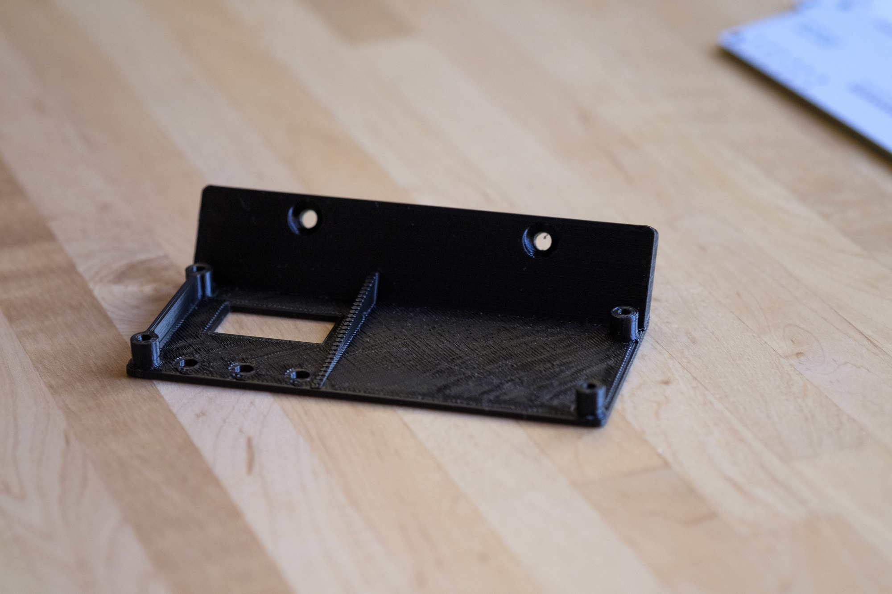
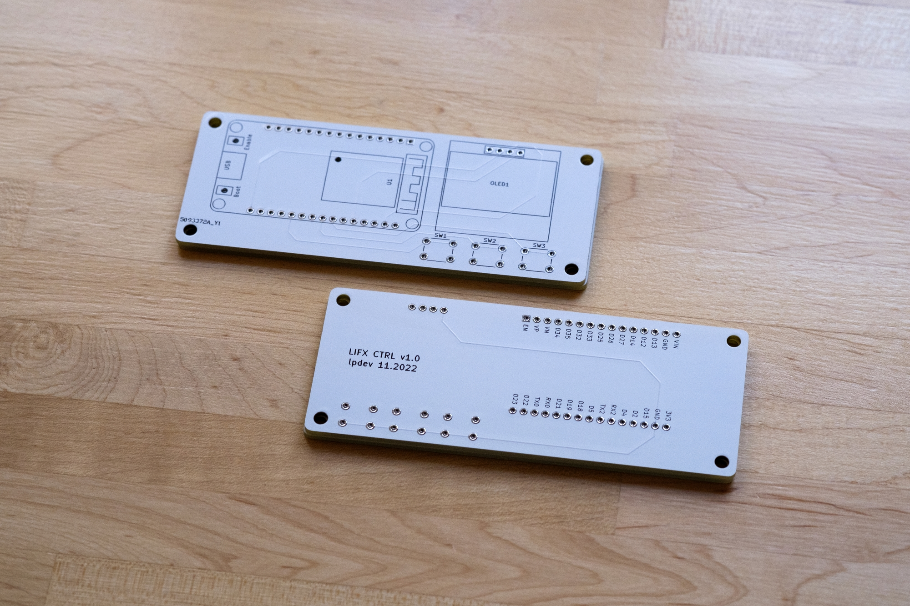

# LIFX Controller

Powered by an ESP-WROOM-32 board. The OLED display uses the SSD1306 driver.

## Dependency Information

- Using MicroPython and its builtin modules:
  - `time` for sleep delays
  - `machine` for controlling pins
  - `network` for connecting to WiFi
  - `urequests` for sending HTTP requests
- My own packages and manually downloaded modules should live in the `lib` directory, which lets me easily import them in `boot.py` and `main.py`

## Custom PCB

Designed in [KiCad](https://www.kicad.org/) and manufactured by [PCBWay](https://pcbway.com/g/vgH8zT)

Get $5 off your first order using my referral link: [https://pcbway.com/g/vgH8zT](https://pcbway.com/g/vgH8zT) - that's basically a free order of PCBs!

## Original Project by Luke Peters

